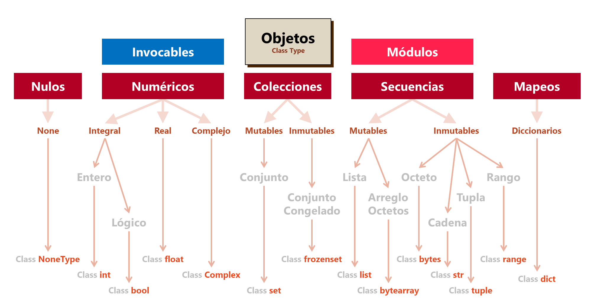

# Programación

<code>Introducción a la programación con Python</code>

Creado por <code>Giancarlo Ortiz</code> para explicar los fundamentos de la <code>programación</code>

---
## Tipos de Datos
En un lenguaje de programación los tipos definen los atributos que puede tomar una variable, clasificando los valores en un sistema de tipos que impone restricciones en las operaciones que se pueden realizar.

* ><i>"Se cometen muchos menos errores usando datos incorrectos que no empleando dato alguno."</i> 
<cite style="display:block; text-align: right">[Charles Babbage](https://es.wikipedia.org/wiki/Charles_Babbage)</cite>

---
### Clasificación de tipos
Las plataformas o arquitecturas de computadores y los lenguajes de programación disponen de tipos similares a la clasificación matemática de los números y pueden tener tipos como:
* __Entero__ (Int)
* __Real__ (Float)
* __lógico__ (Bool)
* __Complejo__ (Complex)
* __Carácter__ (Char)

---
### Colecciones de datos 
Los lenguajes de programación definen colecciones de datos como un tipo de dato, de forma que un lenguaje también puede incluir tipos como:
* __Listas__ (List)
* __Arreglos__ (Array)
* __Secuencias__ (Float)
* __Tuplas__ (Bool)
* __Diccionarios__ (Complex)
* __Cadenas de caracteres__ (Str)

---
### Datos compuestos
Algunos lenguajes de programación definen conjuntos estructurados de datos que a su vez son otro tipo de dato, de forma que un lenguaje también puede incluir tipos complejos como:
* __Clases__ (Class)
* __Objetos__ (Obj)
* __Funciones__ (Function)

---
### Datos abstractos
Algunos lenguajes de programación permiten al usuario definir nuevos tipos de  datos, de forma que el programador pueda crear  estructuras de datos o colecciones estructuradas que se derivan de los tipos incluidos:
* __Arboles__ (Tree)
* __Pilas__ (Stack)
* __Colas__ (Queue)
* __Grafos__ (Graph)

---
### Tipos en Python
* En Python todo es un objeto, incluyendo las variables, esto porque en Python, los tipos de datos son clases.
* Las clases que definen los tipos de datos heredan propiedades de una meta-clase "__object__". 
* En Python existen __14__ tipos de datos básicos con sus operaciones asociadas.

---
### Jerarquía de tipos en Python

---
### Tipos invocables en Python
Adicionalmente a los tipos de datos básicos el interprete de Python permite la definición de otros objetos:
* __Clases:__ se crean mediante definiciones de clase, con el propósito de ser plantillas para la creación de objetos.
* __Funciones:__ se crean mediante definiciones de función, con el propósito de ser invocadas posteriormente.
* __Métodos:__ son funciones que se llaman usando la notación de atributos de clase.

---
## Módulos y paquetes en Python 
* Un __modulo__ es un fichero que contiene instrucciones y definiciones de otros objetos en su interior.
* Para que un modulo se puede importar desde otro modulo para agregar funcionalidad.
* Un __paquete__ es una carpeta especial que contiene varios módulos en su interior.
* Para que una carpeta sea un paquete y se pueda importar desde otros ficheros debe incluir un fichero de especial llamado "**\_\_init\_\_.py**"

---
## Identificadores
* Los identificadores son nombres que el programador usa para hacer referencia a los objetos de un programa; estos pueden ser constantes, variables, funciones, clases, etc...

* ><i>"Explícito es mejor que implícito... Simple es mejor que complejo... La legibilidad es importante."</i> 
<cite style="display:block; text-align: right">[Tim Peters, Zen de Python](https://es.wikipedia.org/wiki/Tim_Peters)</cite>

---
### Identificadores en Python
Python distingue mayúsculas de minúsculas y restringe el uso de identificadores con las siguientes reglas:
* No pueden utilizarse [__palabras reservadas__](https://es.wikipedia.org/wiki/Palabra_reservada) del lenguaje, espacios en blanco o símbolos de puntuación.
* El primer carácter debe ser una letra o el carácter de subrayado 
**[a-z, A-Z, _]**
* El segundo y siguientes pueden ser dígitos, letras o caracteres de subrayado **[a-z, A-Z, 1-9, _]**

---
## El ámbito y los espacios de nombres
* El ámbito es el contexto que pertenece un identificador dentro de un programa.
* Un espacio de nombres es una región declarativa y aislada que proporciona un ámbito a un grupo de identificadores en su interior.
* Si un identificador no se declara en un espacio de nombres su ámbito es el espacio de nombres global.
* Es posible usar el mismo identificador en diferentes ámbitos que hacen referencia a objetos distintos.

---
### El ámbito en Python
* En Python al iniciar el interprete se crea un espacio de nombres global.
* En este espacio se incluyen todas las definiciones incorporadas "built-in" para que sean accesibles.
* Al incorporar módulos cada uno de ellos crea un espacio de nombres global.
* Cuando se invoca Las funciones al interior de los módulos, estas crean un espacio de nombres local.
* Las variables definidas en una función son locales a la función y no existen fuera de ella.
* Las funciones dentro de los script son globales y cualquier sentencia puede modificarla. 

---
### Modificadores de ámbito en python
En python se puede modificar el ámbito por defecto en la definición usando las palabras reservadas:
* __nonlocal:__ para definir variables dentro de funciones anidadas, donde esta no debe pertenecer a la función interna.
* __global:__ para definir variables globales dentro de funciones.

---
## Mas Recursos
- [Arboles](https://es.wikipedia.org/wiki/%C3%81rbol_(inform%C3%A1tica)) (Wikipedia)
- [Pilas](https://es.wikipedia.org/wiki/Pila_(inform%C3%A1tica)) (Wikipedia)
- [Colas](https://es.wikipedia.org/wiki/Cola_(inform%C3%A1tica)) (Wikipedia)
- [Grafos](https://es.wikipedia.org/wiki/Grafo_(tipo_de_dato_abstracto)) (Wikipedia)